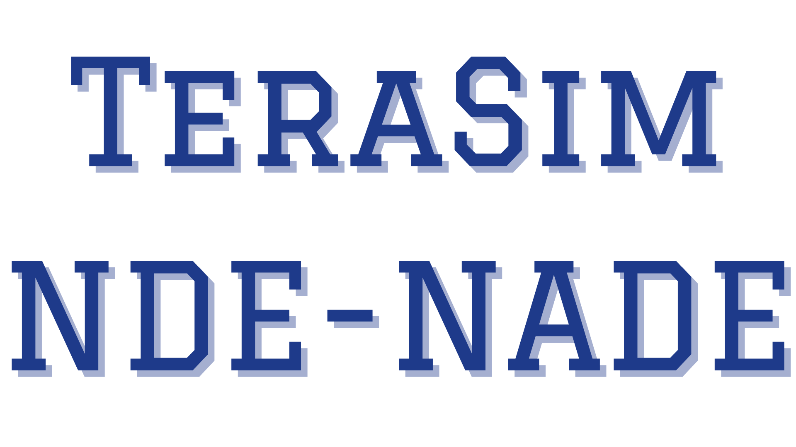
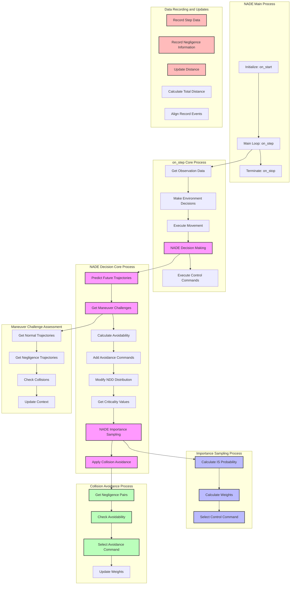

<div align="center">
<p align="center">



</p>
</div>

## 🚀 Introduction

### What is TeraSim-NDE-NADE?
TeraSim-NDE-NADE is the traffic environment for TeraSim, which is an advanced **generative simulation framework** designed for testing autonomous vehicles (AVs) in **naturalistic** and **adversarial** environments. Unlike traditional scenario-based approaches, our method generates interactive, real-world-like traffic environments to **accelerate AV safety testing by 10³ - 10⁵ times**.

### Key Features
- **Naturalistic Driving Environment (NDE):**
  - Trained and calibrated using **large-scale real-world driving data**
  - Fully **interactive and dynamic**
- **Adversity Injection:**
  - **Vehicle Adversity** (e.g., aggressive lane changes, hard braking)
  - **Vulnerable Road User (VRU) Adversity** (e.g., jaywalking, running red lights)
  - **Static Adversity** (e.g., construction zones, faulty traffic signals)
  - Includes **trigger conditions, effects, and probability modeling**
- **Naturalistic and Adversarial Driving Environment (NADE):**
  - **AI-powered dynamic control of adversity injection**
  - **Optimized based on real-world accident data**
  - **Ensures large-scale, accelerated safety evaluation**

## 🏗 Code Architecture

### System Architecture


## 🔧 Installation & Configuration

### 1. Install Dependencies
Ensure you have **TeraSim** installed:
```bash
git clone https://github.com/mcity/TeraSim
cd TeraSim
pip install -e .
cd ..
```

### 2. Install Poetry (if not already installed)
```bash
curl -sSL https://install.python-poetry.org | python3 -
```

### 3. Install TeraSim-NDE-NADE
```bash
git clone https://github.com/mcity/TeraSim-NDE-NADE
cd TeraSim-NDE-ITE
poetry install
```

## 📌 Usage Example

Please refer to the `/examples` directory for detailed usage examples and tutorials.

The examples demonstrate:
- Setting up a naturalistic driving environment
- Configuring adversarial scenarios
- Running simulations with different parameters
- Analyzing simulation results

## 🤝 Contributing

We welcome contributions to improve **TeraSim-NDE-NADE**! To contribute:

1. **Fork** the repository
2. **Create a feature branch** (`feature/new-adversity-model`)
3. **Submit a Pull Request (PR)**
4. **Join the discussion and help advance AV safety testing!**


## 🔄 System Workflow

Below is a detailed workflow diagram showing the key processes in TeraSim-NDE-NADE:



Join us in making **autonomous vehicles safer** with **realistic, generative simulation**! 🚗💡

